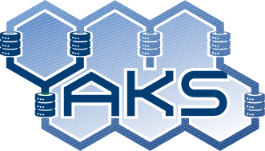
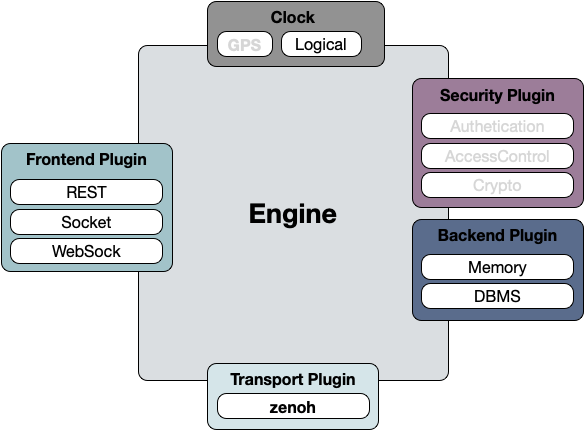
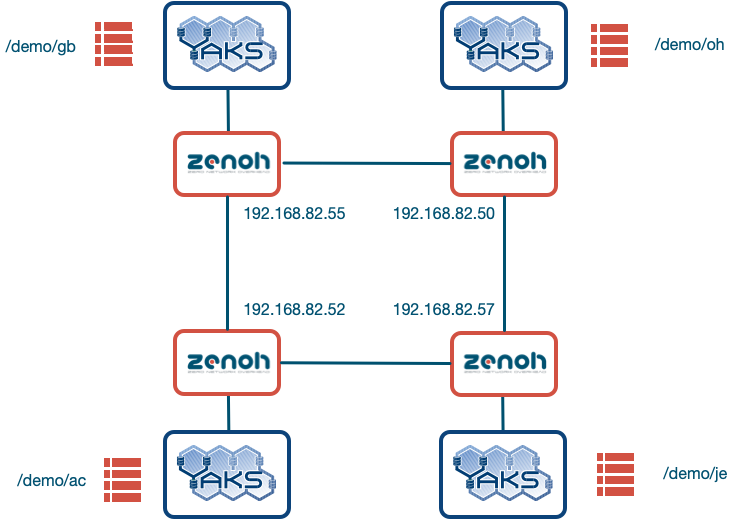

Getting Started with YAKS
=========================

This short guide will get you started with using Yaks through the python
client API.

YAKS Overview
=============

YAKS is a **distributed service** that **implements** an **eventually
consistent**, **scalable**, **location transparent,** **high
performance**, and **distributed** **key/value store** with pluggable
back-ends and front-ends.

The current version of YAKS supports REST, Socket and WebSocket
front-ends along with main memory and DBMS backends.

YAKS is equipped with **dynamic discovery** and supports extremely well
**dynamic environments.** YAKS **data is globally accessible** **without
requiring local replication** as in traditional key/value stores.

In a way, Yaks can be thought as a distributed fabric to integrate and
data at rest and data in movement and access it in a location
transparent manner.

YAKS Key Abstractions
---------------------

YAKS builds upon relatively small set of abstractions, notably:

-  **Path.** A set of string separated by a '/', as in a filesystem
   path, such as, /demo/ac/one, /building/1/home/2/floor/3
-  **Selector.** An expression that contains wildcards, query and
   projections, such as, /building/1/home/*/floor/*, /building/1/\*\*,
   /building/1/home/1/floor/\*/lamp?luminosity<10
-  **Value.** A user provided data item along with its encoding. Yaks
   supports natively several encodings, such as **raw**, **string**,
   **JSON,** and **DB.** For natively supported encodings Yaks will
   automatically try to perform conversions when necessary.
-  **Backend.** A storage technology, such as DBMS, Main Memory, NoSQL
   stores, etc.
-  **Frontend.** A connectivity technology, such as REST, TCP/IP, etc.
-  **Storage.** An entity storing tuples on a specific backend.
   Storages can be created by applications and take responsibility for
   storing all tuples whose **path** matches the storage **selector**
-  **Subscriber.** An entity registering interest for being notified
   whenever a tuple with a **path** matchings the subscriber
   selector is put on YAKS. 
-  **Eval.** A computation registered at a specific path. These
   computation can be triggered by evaluating those matching a selector.
-  **Workspace.** The abstraction that give you access to YAKS
   primitives.

Installing the Python API
=========================

The simplest way to install YAKS python's API is through using pip3 as
shown below:

::

    $ pip3 install yaks 

Otherwise you can checkout the Python client library at
``[http://github.com/atolab/yaks-python](http://github.com/atolab/yaks-python)``

**First Steps with YAKS**
=========================

Starting YAKS is rather straight-forward, to start a single instance
simply do:

::

    $ yaksd.exe 

If you want to see all the command line options supported do:

::

    $ yaksd.exe --help

To try your the python API, start the python3 interpreter and try the
following:

::

    $ python3
    Python 3.7.1 (default, Nov 25 2018, 10:47:20) 
    [Clang 10.0.0 (clang-1000.11.45.5)] on darwin
    Type "help", "copyright", "credits" or "license" for more information.
    >>>
    >>> from yaks import *
    >>> y = Yaks.login('127.0.0.1') # assuming yaks is running on the same machine.
    >>> ws = y.workspace('/demo/')
    >>> ws.put('/demo/greeting', Value("Ciao!"))
    >>> ws.get('demo/greeting')
    [('/demo/greeting', array('B', [67, 105, 97, 111, 33]))]
    # Notice that this data is encoded in raw format.

    >>> ws.put('/demo/greeting', Value("Ciao!", encoding=Encoding.STRING))
    >>> ws.get('/demo/greeting')
    [('/demo/greeting', Ciao!)]

It is worth mentioning that this example has used (1) a storage created
by default at start-up for the main memory back-end (this automatic
creation can be disabled by passing the -w command line option), and (2)
the socket front-end.

At this point we suggest that you try to execute the example
`simple.py <https://github.com/atolab/yaks-python/blob/master/examples/client.py>`__
included in the python API. Take a look at the code to learn how to use
the various aspects of the API.

Taking some REST
================

At times it is convenient to interact with Yaks from the command line by
using a simple commands such as **curl**. This can be convenient for
administering a Yaks deployment as well as for easily integrating Yaks
with other tools.

All features supported by Yaks, with the exception of triggered
subscriptions, are available through Yaks REST API. Below is an example
of how to use it.

First off let's start Yaks without and pre-configured storage.

::

    $ ./yaksd.exe -w

In what follows we will create first a storage on the main memory
back-end.

::

    # Create storage called "astore" on main memory 
    curl -X PUT -d '{"selector":"/demo/astore/**"}'\
         http://localhost:8000/@/local/plugins/yaks/backend/Memory/storage/astore
                   

From the command above you'll notice that we create a storage called
``astore`` by performing a PUT operation on the path
``/@/local/plugins/yaks/backend/Memory/storage/astore``

It is worth mentioning that anything below the ``/@`` is the
administration space. From this space it is possible to administer as
well as inspect and monitor a running Yaks system. The way in which this
works is pretty straight forward, each running instance of Yaks has
associated a UUID and its admin space is represented by ``/@/UUID/plugins/yaks`` as a
consequence to operate on an arbitrary Yaks instance it is sufficient to
know its UUID.

To retrieve information about a running system one can simply issue a
GET with a selector that wildcards the UUID as shown below:

::

    $ curl http://localhost:8000/@/*/plugins/yaks
    {"/@/34d34778-21b4-4ba8-9342-3e7a3f38aa06/plugins/yaks" : {}}

This command returns a single tuple as we have a stand-alone system.
When issued on a system in which multiple instances of Yaks are
available will return the list of all available instances.

Now suppose we want to see the storages defined on our node, we can
simply issue the following command:

::

    $ curl http://localhost:8000/@/local/plugins/yaks/backend/**
    {"/@/34d34778-21b4-4ba8-9342-3e7a3f38aa06/plugins/yaks/backend/Memory/storage/astore" : {"selector":"/demo/astore/**"},
    "/@/34d34778-21b4-4ba8-9342-3e7a3f38aa06/plugins/yaks/backend/Memory" : {"is.yaks.backend.kind":"memory"}}

If we now create another storage:

::

    # Create storage called "bstore" on main memory 
    curl -X PUT -d '{"selector":"/demo/bstore/**"}'\
         http://localhost:8000/@/local/plugins/yaks/backend/Memory/storage/bstore               

We can see that the information is reflected on the administration
space:

::

    $ curl http://localhost:8000/@/local/plugins/yaks/backend/**
    {"/@/34d34778-21b4-4ba8-9342-3e7a3f38aa06/plugins/yaks/backend/Memory/storage/bstore" : {"selector":"/demo/bstore/**"},
    "/@/34d34778-21b4-4ba8-9342-3e7a3f38aa06/plugins/yaks/backend/Memory/storage/astore" : {"selector":"/demo/astore/**"},
    "/@/34d34778-21b4-4ba8-9342-3e7a3f38aa06/plugins/yaks/backend/Memory" : {"is.yaks.backend.kind":"memory"}}

As mentioned above, if we wanted to create a storage on a specific YAKS
instance as opposed to the one we are currently connected to, it would
be sufficient to replace ``local`` in the path above with the
appropriate ``UUID``.

Now we can do some put and get in the storages we have created:

::

    $ curl -X PUT -d '{"msg":"ciao"}' http://localhost:8000/demo/astore/greeting   
    $ curl -X PUT -d '{"msg":"hello"}' http://localhost:8000/demo/bstore/greeting   
    $ curl http://localhost:8000/demo/**
    {"/demo/bstore/greeting" : {"msg":"hello"},
    "/demo/astore/greeting" : {"msg":"ciao"}}

**Distributed Deployment**
==========================

Now it is time to experiment with a distributed deployment of YAKS. The
image below denotes the topology that we will setup. The address
reported reflect the address of our testbed and should be updated to
reflect your use case.

To setup this topology you need to do the following steps.

**Step #1 — Setup zenoh**

::

    # on 192.168.86.55
    $ zenohd.exe 

    # on 192.168.86.50
    $ zenohd.exe --peers=tcp/192.168.86.55:7447

    # on 192.168.86.54
    $ zenohd.exe --peers=tcp/192.168.86.50:7447

    # on 192.168.86.52
    $ zenohd.exe --peers=tcp/192.168.86.55:7447,tcp/192.168.86.54:7447

**Step #2 — Setup YAKS**

Notice that we use the "-w" option below to ensure that YAKS does not
create any default storages on "/\*\*".

::

    # on 192.168.86.55
    $ yaksd.exe -w --zenoh=tcp/127.0.0.1:7447

    # on 192.168.86.50
    $ yaksd.exe -w --zenoh=tcp/127.0.0.1:7447

    # on 192.168.86.57
    $ yaksd.exe -w --zenoh=tcp/127.0.0.1:7447

    # on 192.168.86.54
    $ yaksd.exe -w --zenoh=tcp/127.0.0.1:7447

At this point the infrastructure is setup and you can try to issues some
commands.

::
 
    from yaks import *

    def obs(kvs):
        print('Called OBSERVER KVS: {}'.format(kvs))

    def evcb(path, param):
        print('Executing eval on {}'.format(path))
        return Value('executed {}'.format(param), encoding=Encoding.STRING)

    y = Yaks.login('127.0.0.1')
    adm = y.admin()
    s = adm.add_storage("AC-Storage", [Property("selector", "/demo/ac/**")])
    ws = y.workspace('/demo/ac') # or your initials

    ws.put('/demo/ac/uno', Value('ac-uno'))
    ws.put('/demo/je/due', Value('ac-due'))
    ws.put('/demo/oh/tre', Value('ac-tre'))
    ws.put('/demo/gb/due', Value('ac-quattro'))
    ws.get('/demo/**')

    sid = workspace.subscribe('/demo/gb/**', obs)

    # register an eval
     ws.register_eval('/demo/ac/evalme', evcb)

    # trigger the evaluation passing 1 as parameter
    ws.eval('/demo/ac/evalme?(param=1)')

With this set-up you will see how the data is crawled and resolved
across the various instances if YAKS.

Posting and Evaluating Code
===========================
At times it could be useful to have the ability to store code in YAKS and
have some applications evaluate it. As an example, imagine that you have 
some business logic producing some sensor data, now if we wanted to 
dynamically control the filters applied to this data, we may be able to do this
by storing the filters in YAKS and having the application evaluate the filter
available in YAKS. 

The code snippet below, shows precisely this use case.

::

    from yaks import Yaks 
    import jsonpickle
    import random
    import sys 
    import time

    filter = "x > 50"

    def update_filter(kvs):
        global filter
        for kv in kvs:        
            _,v = kv                
            filter = v.value
            print('New Filter: {}'.format(v))        

    def main(addr):
        y = Yaks.login(addr)
        ws = y.workspace('/demo/fprod')
        ws.subscribe('/demo/fprod/filter', update_filter)

        while(True):
            x = random.randint(0, 100) 
            ## The filter is evaluated in the current context
            if eval (filter) == True:
                print (x)
            else:
                print ('Filtered...')
            time.sleep(1)

    if __name__ == "__main__":
        if len(sys.argv) < 2:
            print('[Usage] {} <yaks server address>'.format(sys.argv[0]))
            exit(-1)
        
        addr = sys.argv[1]
        main(addr)

In this code snipped you can see how the filter is associated to the YAKS path '/demo/fprod/filter'
and that this application is triggered each time a filter changed. Changing the filter is as simple
as setting a YAKS value, as shown in the snippet below:

::

    while True:
        f = input(':> input a filter expression in x, such as \"x > 40\", \"x%2 == 0\":\n:>')
        ws.put('/demo/fprod/filter', Value(f, encoding=Encoding.STRING))

YAKS Features
=============

The table below reports the list of missing and partial features for
YAKS 0.2.1.

========================  ==========  ============================================
Name	                   Available   Note
========================  ==========  ============================================
Quorum on get/put	      No	      Will be supported later this year
Multiplicity on eval	  No	      Will be supported later this year.
Eval	                  Partial     Remote eval are not fully supported.
Admin Frontend add/load   No          Will be supported later this year
Admin Backend add/load    No          Will be supported later this year
Admin Session Remove      No          Will be supported later this year
Access Control            No          Available in later version, TBD.
========================  ==========  ============================================